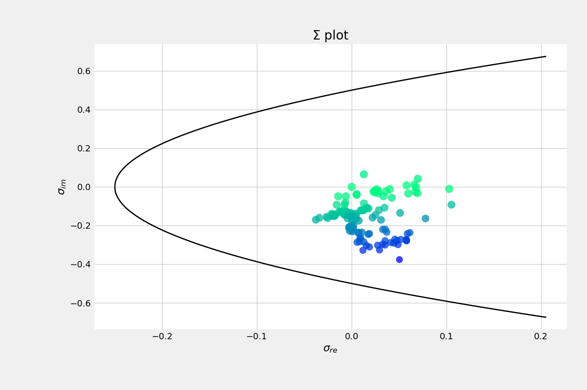
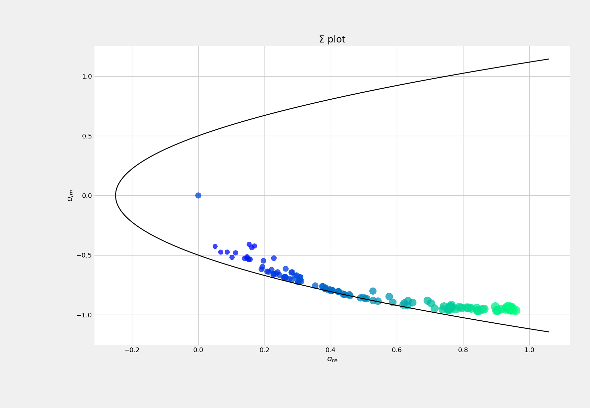

.. _optimization_candidates:

Optimization of candidates
=====================================

Introduction
------------

Planning power grids involves determining an appropriate set of assets that makes sense from both the
technical and economical optics. This challenge can be understood as an optimization problem, where one tries to
minimize the total cost :math:`C = CAPEX+OPEX`, while simultaneously minimizing the technical restrictions 
:math:`f_o`. While apparently simple to comprehend, such a problem in its original form is arduous to solve and a 
satisfying solution may not even be reached.

At this point we have to ask ourselves what the underlying issue is. If the puzzle is rigorously formulated, it
becomes of the type MINLP. Not only it can include continuous variables (such as the rating of a substation), but
also a wide set of integer variables (the potential investments to make). It is well-known that even solving a
single-period OPF with only continuous variables becomes a very complicated problem, to the point where the
original scenario is often convexified to solve it with acceptable precision and time. Now imagine we have to find a
solution to such a problem, but considering the full 8760 hours in a year and thousands of investment combinations.
The result would be catastrophic given the astronomically high computational time.

Hence, it is clear we desire an algorithm that can provide us with a list of optimal investments and not suffer from
the curse of dimensionality. The methodology we have adopted here consists of:

#. Building a machine-learning model that captures the behavior of the grid under diverse scenarios.
#. Optimizing such a model in a matter of a few seconds.

Formulation
-------------

1. **Objective function**
The selected objective function takes into account technical criteria. In particular, it is defined as:

.. math::
    f_o(x) = C_l(x) + C_o(x) + C_v(x)

where :math:`C_l` is a penalty function associated with active power losses, :math:`C_o` accounts for branch
overloadings, and :math:`C_v` gathers the undervoltage and overvoltage penalties. Note here that the unknown
:math:`x` is used to represent the investment combination under consideration. That is, :math:`x` has to be seen 
as a vector that contains an :math:`n`-length set of boolean variables that account for the activated or deactivated 
investments:

.. math::
    x = [x_1, x_2, ..., x_n]

or in compact form, equivalently, :math:`x \in \mathbb{Z}^n_2`.

Regarding the undervoltages and overvoltages, the associated penalty is computed as:

.. math::
    C_v(x) = P_{ov} \max(V_m - V^{\text{max}}_m, 0) + P_{uv} |\max(V^{\text{min}}_m - V_m, 0)|

2. **Black-box optimization with a surrogate model** 
The followed optimization approach derives from the work of Bliek et al. [1]_. 

3. **Algorithm and workflow**

Testing
------------
The system under consideration is the IEEE 118-bus system. We have departed from the file 
'IEEE 118 Bus - ntc_areas_two.gridcal'. The initial system is operating in a relatively safe zone as indicated by
HELM's Sigma plot:

    Sigma plot of the initial IEEE 118-bus grid.
    
Voltage magnitudes are comprised between 0.94 and 1.04, and there is no overloaded line. To greatly compromise
the grid, loads are increased by a factor :math:`\lambda=1.5`. The idea behind this scaling factor is that we aim 
to start with a poorly conditioned system that would incur penalty costs. Then, through the usage of the 
proposed algorithm, attractive investments will be proposed to help alleviate the grid from such issues. For 
reference purposes, the Sigma plot corresponding to the overloaded grid is shown below.

    Sigma plot of the IEEE 118-bus grid, overloaded by a factor :math:`\lambda=1.5`.

The dots moving towards the limit of the parabola is a telling sign that the system is becoming more
ill-conditioned and operates close to the voltage collapse point. Hence, the goal is to propose investments
to operate the grid in safer conditions.

.. Jana, the Vm values are alright, but the loading of some lines seems extreme. Check branches that surpass
.. a loading of 500%, and check where they were in the initial scenario (lambda=1) 

.. Jana, in view of the results, we should propose investments that minimize the loading more than everything
.. else

.. [1] Bliek, Laurens, Arthur Guijt, Sicco Verwer, and Mathijs De Weerdt. "Black-box mixed-variable optimisation using a surrogate model that satisfies integer constraints." In Proceedings of the Genetic and Evolutionary Computation Conference Companion, pp. 1851-1859. 2021.